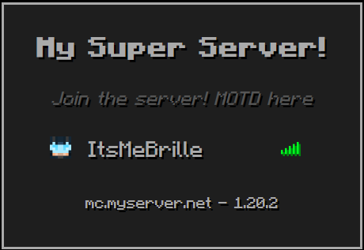

# MMM-MinecraftServer Module for MagicMirror²

The MMM-MinecraftServer module is designed for [MagicMirror²](https://github.com/MichMich/MagicMirror) to display the list of online players on a Minecraft server.



## Installation

1. Navigate to your MagicMirror's `modules` directory.
2. Clone this repository:
   ```sh
   git clone https://github.com/ItsMeBrille/MMM-MinecraftServer.git
   ```

## Configuration

To use this module, add it to the modules array in the `config/config.js` file of your MagicMirror:

```javascript
{
  module: "MMM-MinecraftServer",
  position: "top_right",
  config: {
    ip: "your_minecraft_server_ip", // server ip (required)
    title: "Minecraft Server", // display title
    hidePlayers: false, // Hide player list
    maxPlayers: 5, // Max players to show in list
    hideInfo: false, // Hide bottom info (ip, version)
    updateInterval: 5, // update interval in minutes
  }
}
```

## APIs

- Anders G. Jørgensen's [Minecraft Server Status API](https://api.mcsrvstat.us/) for server info.
- [MCHeads](https://mc-heads.net/) to get current players avatars.

## License

This project is licensed under the MIT License - see the [LICENSE](LICENSE) file for details.
```